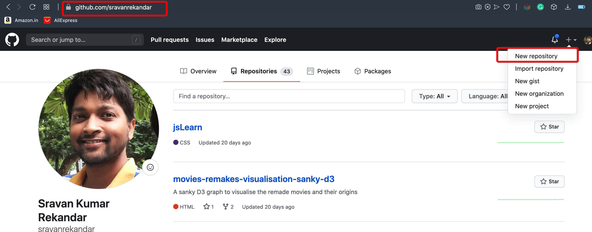
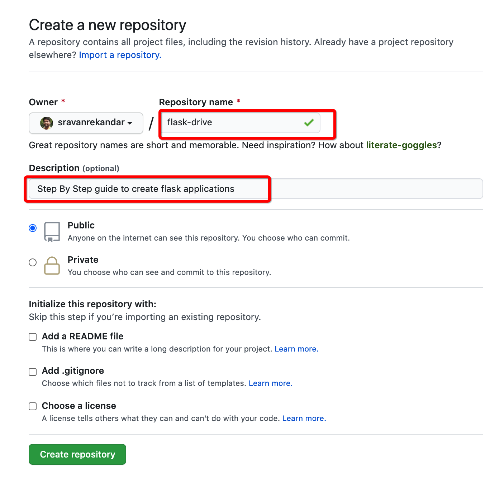
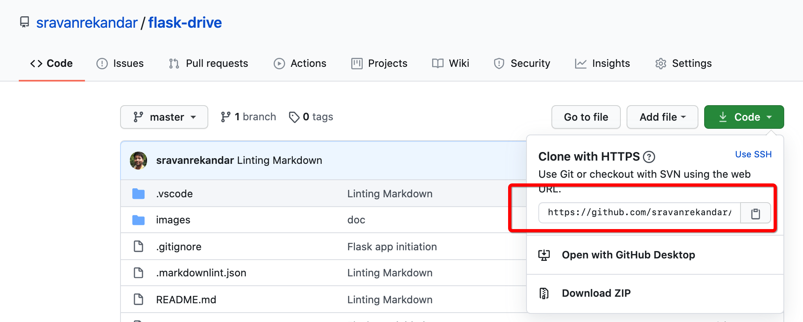

# Flask-Drive Chapter 01: Create basic application and upload to github

## Create a directory for your experiment

```bash
$ mkdir flask-drive

$ cd flask-drive
```

## Initiate Git repository

```bash
$ git init
```

## Create README.md and enter some text in the file

```bash
$ touch README.md
```

## Check the available files in your folder(aka directory)

### list all contents with details

```bash
$ ls -la
drwxr-xr-x   4 sravan  staff   128 Aug 27 12:32 .
drwxr-xr-x  81 sravan  staff  2592 Aug 27 12:28 ..
drwxr-xr-x  10 sravan  staff   320 Aug 27 12:32 .git
-rw-r--r--   1 sravan  staff    95 Aug 27 12:33 README.md
```

### list all files/folders

```bash
$ ls -a
.    ..    .git    README.md
```

### list on the file names in multiple lines

```bash
$ ls -a | awk '{print $NF}'
.
..
.git
README.md
```

### List the contents of .git/

These files/folders in .git/ are created when you ran ```git int``` command

```bash
$ ls -a .git | awk '{print $NF}'
.
..
FETCH_HEAD
HEAD
config
description
hooks
info
objects
refs
```

## Committing the changes

### Check the status of your git repo

```bash
$ git status
On branch master

No commits yet

Untracked files:
  (use "git add <file>..." to include in what will be committed)
  README.md

nothing added to commit but untracked files present (use "git add" to track)
```

### Stage the changes to commit

```bash
$ git add README.md
$ git status
On branch master

No commits yet

Changes to be committed:
  (use "git rm --cached <file>..." to unstage)
  new file:   README.md
```

### Commit the staged changes with a message

```bash
$ git commit -m "first-commit"
[master (root-commit) 157be18] first-commit
 1 file changed, 41 insertions(+)
 create mode 100644 README.md

$ git status
On branch master
Changes not staged for commit:
  (use "git add <file>..." to update what will be committed)
  (use "git restore <file>..." to discard changes in working directory)
  modified:   README.md

no changes added to commit (use "git add" and/or "git commit -a")
```

## Track the progress with ```git log``` command

```bash
$ git log
commit 157be18f961275a48a89b025a9f1d4216edb559c (HEAD -> master)
Author: Sravan Kumar <sravan.rekandar@drishya.ai>
Date:   Thu Aug 27 12:42:29 2020 +0530

    first-commit

```

## Create Python Virtual Environment

### Check python version

it should be >= 3.5

```bash
$ python --version
Python 3.7.6
```

### Create a virtual environment

There are two modules that can be used to achieve this.
Use either of the following tools

#### Using python's native _venv_

- ```-m venv```: Use the module "venv" (This is available by default
with python installation)
- ```env-my-flask-app```: Name of your python environment

```bash
$ python -m venv env-my-flask-app
```

#### Using pip's _virtualenv_ for python < 3.3

First you have to install _virtualenv_ globally. Run the below command

```bash
$ pip install virtualenv
```

Now you can create the environment.

```bash
$ virtualenv env-my-flask-app
```

### Environment folder

The above command should have created a folder called ```env-my-flask-app```

```bash
$ ls | awk '{print $NF}'
README.md
env-my-flask-app

$ ls env-my-flask-app | awk '{print $NF}'
bin
include
lib
pyvenv.cfg
```

## Activating the virtual environment

You will need to do this each time you enter the terminal/ command prompt

### For unix based OS

```bash
$ source env-my-flask-app/bin/activate
(env-my-flask-app) $

### For windows OS

```bat
> env-my-flask-app/Settings/activate
(env-my-flask-app) >
```

By activating the environment, you will see the ```(env-my-flask-app)``` in your
command line

### Deactivating environment

1. Environment will be deactivated when you close your terminal/command prompt
2. You can explicitly deactivate by running the following command

```bash
(env-my-flask-app) $ deactivate
$
```

## Preventing git to track the environment folder

Your environment folder is specific to your machine. You are not supposed to
check-in (Committing) the folder to git.

```bash
$ source env-my-flask-app/bin/activate
(env-my-flask-app) $ git status
On branch master
Changes not staged for commit:
  (use "git add <file>..." to update what will be committed)
  (use "git restore <file>..." to discard changes in working directory)
  modified:   README.md

Untracked files:
  (use "git add <file>..." to include in what will be committed)
  env-my-flask-app/
```

### Add ```.gitignore``` file

Enter the below contents in .gitignore

```text
env-my-flask-app/
```

### Checking the repo status

Because we have updated ```.gitignore``` with the environment folder,
git will not track the folder

```bash
git status
On branch master
Changes not staged for commit:
  (use "git add <file>..." to update what will be committed)
  (use "git restore <file>..." to discard changes in working directory)
  modified:   README.md

Untracked files:
  (use "git add <file>..." to include in what will be committed)
  .gitignore

no changes added to commit (use "git add" and/or "git commit -a")
```

### Stage and Commit the changes

```bash
(env-my-flask-app) $  git add -A

(env-my-flask-app) $  git commit -m "Adding git ignore and some documentation"
[master f67feca] Adding git ignore and some documentation
 2 files changed, 200 insertions(+), 2 deletions(-)
 create mode 100644 .gitignore

(env-my-flask-app) $  git status
On branch master
nothing to commit, working tree clean

(env-my-flask-app) $  git log
commit f67feca2a7a02932d6e2fc0371b81dc514d605fa (HEAD -> master)
Author: Sravan Kumar <sravan.rekandar@drishya.ai>
Date:   Thu Aug 27 13:15:23 2020 +0530

    Adding git ignore and some documentation

commit 157be18f961275a48a89b025a9f1d4216edb559c
Author: Sravan Kumar <sravan.rekandar@drishya.ai>
Date:   Thu Aug 27 12:42:29 2020 +0530

    first-commit
```

## Enhancing .gitignore

There are bunch of other files/folder we do not want to track. Typical patterns
are provided in [.gitignore](.gitignore). Copy the contents of this file
to your .gitignore. Then commit the changes

## Install Flask dependency

```bash
(env-my-flask-app) $ python -m pip install Flask
Collecting Flask
.....logs....logs (Replacing the logs for brevity)
.....logs....logs
```

### Getting the installed package list

```bash
(env-my-flask-app) $ python -m pip freeze
click==7.1.2
Flask==1.1.2
itsdangerous==1.1.0
Jinja2==2.11.2
MarkupSafe==1.1.1
Werkzeug==1.0.1
```

Installing Flask resulted in installing the dependency packages for Flask.

### Writing the dependency modules list the ```requirements.txt```

```bash
(env-my-flask-app) $ python -m pip freeze > requirements.txt

(env-my-flask-app) $ ls
README.md    env-my-flask-app  requirements.txt

(env-my-flask-app) $ cat requirements.txt
click==7.1.2
Flask==1.1.2
itsdangerous==1.1.0
Jinja2==2.11.2
MarkupSafe==1.1.1
Werkzeug==1.0.1
```

## Starting Flask script

- Create ```app``` folder
Create ```app/run.py``` and enter the below contents

```bash
$ mkdir app
$ touch app/run.py
```

```python
"""app/run.py"""
from flask import Flask
app = Flask(__name__)


@app.route('/')
def hello():
    return "Hello World!"


@app.route('/<name>')
def hello_name(name):
    return "Hello {}!".format(name)

if __name__ == '__main__':
    app.run()
```

## Start Flask server app

```bash
$ python app/run.py
 * Serving Flask app "app" (lazy loading)
 * Environment: production
   WARNING: This is a development server. Do not use it in a production deployment.
   Use a production WSGI server instead.
 * Debug mode: off
 * Running on http://127.0.0.1:5000/ (Press CTRL+C to quit)
```

### Using the flask app in a browsers

Goto a web browser of your choice, you can open any of the below urls.
All three urls are same.

- [http://127.0.0.1:5000/](http://127.0.0.1:5000/)
- [http://localhost:5000/](http://localhost:5000/)
- [http://0.0.0.0:5000/](http://0.0.0.0:5000/)

- ```http://```: Hyper Text Transfer Protocol. [Read More](https://en.wikipedia.org/wiki/Hypertext_Transfer_Protocol)
- ```127.0.0.1```: Default IP of your machine
- ```localhost```: Default host name of your machine

## Creating Github repository

- You should have a github account
- Goto your github account (Mine is github.com/sravanrekandar)
- Create a new repository with name "flask-drive"




## Connecting local repo to the github repo

- Once you create a repo in github, you will see instructions to connect
your local repo to the remote(on the github cloud) repo


_*Note: Replace my repo url with your respective reo urls*_

Connecting command

```bash
$ git remote add origin https://github.com/sravanrekandar/flask-drive.git
```

In Git, "master" is a naming convention for a branch. After cloning (downloading)
a project from a remote server, the resulting local repository has a single local
branch: the so-called "master" branch. This means that "master" can be seen as
a repository's "default" branch. [Read more](https://www.git-tower.com/learn/git/glossary/master#:~:text=In%20Git%2C%20"master"%20is,a%20repository%27s%20"default"%20branch.)

```bash
$ git branch -M master
```

By now you had successfully connected your local repo to the remote repo.
To cross check the remote info, run the below command

```bash
(env-my-flask-app) $ git config --get remote.origin.url
https://github.com/sravanrekandar/flask-drive.git
```

## Pushing your changes to remote repo

```bash
$ git push -u origin master
```

- ```-u``` or ```--set-up-stream``` : Upstream branch

Now goto your github repository page and refresh. If everything goes fine,
you must see the uploaded files.

## Deleting the local repository and fetching from github

### Deactivate before you come out of the folder

```bash
(env-my-flask-app) $ deactivate
$
```

### Delete the folder

```bash
$ cd ..
$ rm -rf flask-drive
```

### Cloning the cloud repository to your local machine

You will find the url of your git repo in your github repo page.



_*Change the url with your respective git repo url*_

```bash
$ sravan@Sravans-MacBook-Pro workapce % git clone https://github.com/sravanrekandar/flask-drive.git

Cloning into 'flask-drive'...
remote: Enumerating objects: 30, done.
remote: Counting objects: 100% (30/30), done.
remote: Compressing objects: 100% (20/20), done.
remote: Total 30 (delta 7), reused 29 (delta 6), pack-reused 0
Receiving objects: 100% (30/30), 1.28 MiB | 58.00 KiB/s, done.
Resolving deltas: 100% (7/7), done.
```

## Creating virtual environment with name 'env'

```bash
$ cd flask-drive
$ python -m venv env
$ source env/bin/activate
(env) $
```

## Install dependencies with requirements.txt

```bash
(env) $ python -m pip install -r requirements.txt
```

## Starting the application

```bash
(env) $ python app/run.py
 * Serving Flask app "app" (lazy loading)
 * Environment: production
   WARNING: This is a development server. Do not use it in a production deployment.
   Use a production WSGI server instead.
 * Debug mode: off
 * Running on http://127.0.0.1:5000/ (Press CTRL+C to quit)
```

Goto your browser and open  [http://127.0.0.1:5000/](http://127.0.0.1:5000/ )
