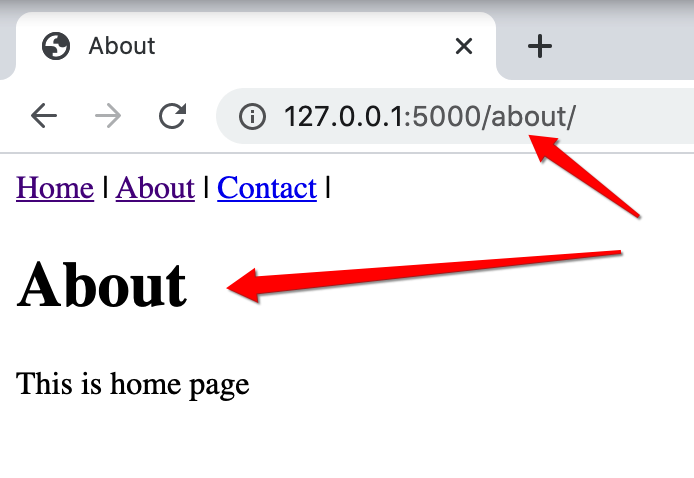
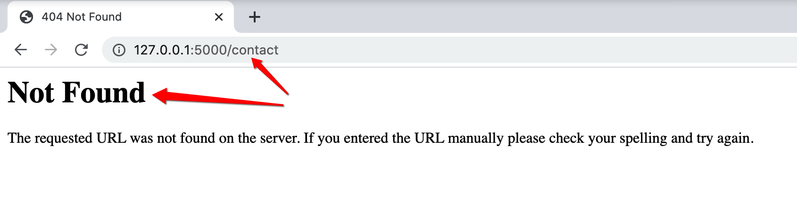
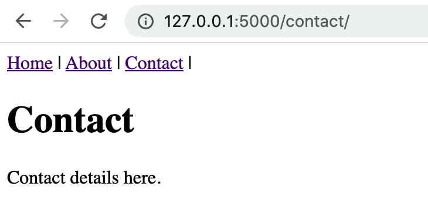
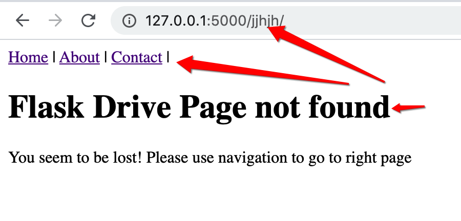

# Flask-Drive Chapter 02

## Flask App routes - Serving HTML pages

Update your app/run.py with the below content

```python
'''app/run.py'''
from flask import Flask

app = Flask(__name__)


@app.route("/")
def home():
    return "Home Page, serves simple text"


@app.route("/about/")
def about():
    return "<h1>About Page!</h1><p>Serves HTML</p>"


if __name__ == "__main__":
    app.run()

```

### Explanation: Two routes in this app

- ```@app.route('/')``` this is the default route.
Also called as home route. This is returning a text string.
- ```@app.route('/about/')```  this is another route with name **about**. This is returning a HTML string.

Save the file, start the server using the following command

```bash
(env) $ python app/run.py
 * Serving Flask app "run" (lazy loading)
 * Environment: production
   WARNING: This is a development server. Do not use it in a production deployment.
   Use a production WSGI server instead.
 * Debug mode: off
 * Running on http://127.0.0.1:5000/ (Press CTRL+C to quit)
```

Now goto a browser and

- Open [http://127.0.0.1:5000/](http://127.0.0.1:5000/)
You must see "Home Page, serves simple text"
- Open [http://127.0.0.1:5000/about](http://127.0.0.1:5000/about)

You must see a heading and a paragraph.

## Serving HTML pages with header

```python
from flask import Flask

app = Flask(__name__)

nav = """
<nav>
    <a href="/">Home</a> |
    <a href="/about">About</a> |
    <a href="/contact">Contact</a> |
</nav>
"""

@app.route("/")
@app.route("/home/")
def home():
    """Home Page."""
    title = "Home"
    return f"""
        <!Docstring html>
        <html>
            <header>
                <title>{title}</title>
            </header>
            <body>
                {nav}
                <h1>{title}</h1>
                <p>This is home page</p>
            </body>
        </html>
    """


@app.route("/about/")
def about():
    """About Page."""
    title = "About"
    return f"""
        <!Docstring html>
        <html>
            <header>
                <title>{title}</title>
            </header>
            <body>
                {nav}
                <h1>{title}</h1>
                <p>This is home page</p>
            </body>
        </html>
    """

if __name__ == "__main__":
    app.run()
```

### HTML: Hyper Text Markup language

HTML is a simple to understand convention that when you serve it to browsers, they understand the HTML text, and display in respective form.

The tags we have supplied

- ```<H1></H1>```: Heading-Level-1 opening and closing tags
- ```<p></p>```: Paragraph open and closing tags

If you start the server using ```python app/run.py```  and navigate to [http://127.0.0.1:5000/](http://127.0.0.1:5000/) browser, you can see the HTML rendered. Click the links in the HTML page to navigate

#### About page



#### Contact Page (Not found)

This is not found because we did not handle


### Code explanation - Route aliases

```python
@app.route("/")
@app.route("/home/")
def home():
    ....
    ....
```

The above states: the method ```home()``` in invoked for

1. [http://127.0.0.1:5000/](http://127.0.0.1:5000/)
2. [http://127.0.0.1:5000/home](http://127.0.0.1:5000/home)

- What is happening here is, for each of the two defined routes, we are returning the calculated HTML strings.
- The nav section is reused. This is injected into the HTML string of the home and about HTML strings.
- There is no handler for ```/contact/``` thats why when you use url [http://127.0.0.1:5000/contact](http://127.0.0.1:5000/contact), you will see a Page not found error (Error Code is 404).

## Adding Contact Page and Not found page with Header.

```python
from flask import Flask

app = Flask(__name__)

nav = """
<nav>
    <a href="/">Home</a> |
    <a href="/about">About</a> |
    <a href="/contact">Contact</a> |
</nav>
"""


@app.route("/")
@app.route("/home/")
def home():
    """Home Page."""
    title = "Home"
    return f"""
        <!Docstring html>
        <html>
            <header>
                <title>{title}</title>
            </header>
            <body>
                {nav}
                <h1>{title}</h1>
                <p>This is home page</p>
            </body>
        </html>
    """


@app.route("/about/")
def about():
    """About Page."""
    title = "About"
    return f"""
        <!Docstring html>
        <html>
            <header>
                <title>{title}</title>
            </header>
            <body>
                {nav}
                <h1>{title}</h1>
                <p>This is home page</p>
            </body>
        </html>
    """


@app.route("/contact/")
def contact():
    """Contact Page."""
    title = "Contact"
    return f"""
        <!Docstring html>
        <html>
            <header>
                <title>{title}</title>
            </header>
            <body>
                {nav}
                <h1>{title}</h1>
                <p>Contact details here.</p>
            </body>
        </html>
    """


@app.errorhandler(404)
def page_not_found(e):
    """Not Found Page."""
    title = "Flask Drive Page not found"
    return f"""
        <!Docstring html>
        <html>
            <header>
                <title>{title}</title>
            </header>
            <body>
                {nav}
                <h1>{title}</h1>
                <p>
                    You seem to be lost!
                    Please use navigation to go to right page
                </p>
            </body>
        </html>
    """


if __name__ == "__main__":
    app.run()

```

### Contact pge is handled now



### Not found is also handled nicely

Instead of leaving to the the browser's default Page not Found page, We are handling it nicely


