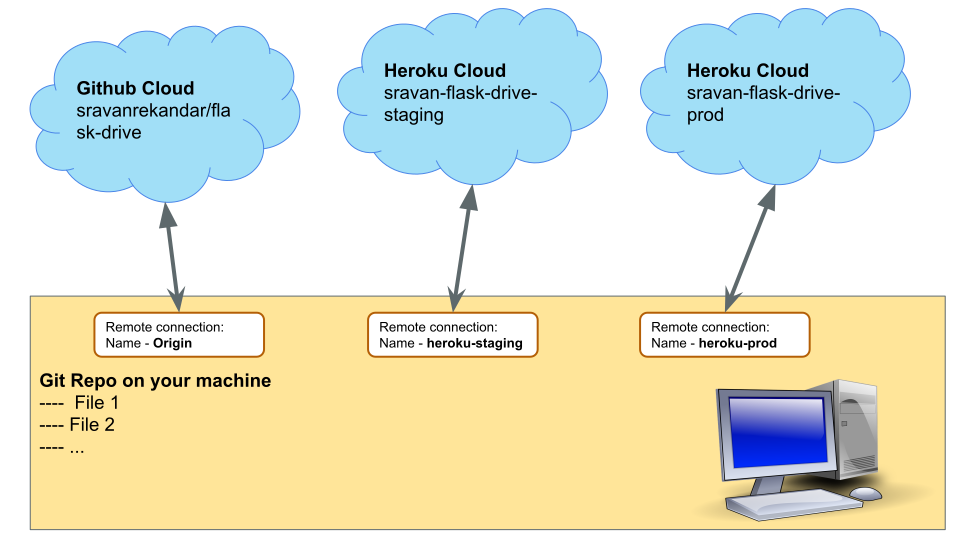

# Flask-Drive Chapter 04: Deploying the python app in heroku cloud

So far you are running your application in your machine. This is not servable to others. Meaning, if you want another person to access your application, you need to deploy the application on to a cloud environment and make it available thorough a [URL](https://en.wikipedia.org/wiki/URL).

## Cloud providers

There are many cloud providers in the market. Naming a few below. You can explore and take advantage of the free resources they provide for learning purposes.

_Reference Article: [What are cloud providers](https://www.redhat.com/en/topics/cloud-computing/what-are-cloud-providers)_

- [AWS](https://aws.amazon.com/)
- [Azure](https://azure.microsoft.com/)
- [GCP - Google Cloud Platform](https://cloud.google.com/gcp)
- [Heroku](https://dashboard.heroku.com/) __WE will use this in this tutorial__
- [Digital Ocean](https://try.digitalocean.com/developerbrand)
- And there are many more. You can search on Google and find out the available options

For this tutorial, we will deploy our apps on [Heroku](https://dashboard.heroku.com/).

## Working on Heroku

- Create a free account on Heroku
- The UI might change time to time. Explore the pricing options, and other beginner tutorials on Heroku
- Install [Heroku CLI](https://devcenter.heroku.com/articles/heroku-cli) on your machine

*_CLI: Command Line Interface_*

### Verify your installation

```bash
$ heroku --version
heroku/7.0.0 (darwin-x64) node-v8.0.0
```

### Heroku Login from your command line

```bash
$ heroku login
heroku: Press any key to open up the browser to login or q to exit
 ›   Warning: If browser does not open, visit
 ›   https://cli-auth.heroku.com/auth/browser/***
heroku: Waiting for login...
Logging in... done
Logged in as me@example.com
```

### Creating an application on heroku

_[Reference Article](https://devcenter.heroku.com/articles/git#creating-a-heroku-remote)_

### Staging and Prod applications

We will create two applications

- **Staging**: Few call it as _Non Prod_. We use this application for our development and testing purposes. We do not share the url of this application with the end users. If things break here, it is fine. Because we want to know the bugs and fix them.
- **Prod** Production application: This is where your application finally deployed before sharing it to users. If things break here, you will loose business. Thats why When your are confident of the application on Staging, you will push it to production

### Other strategies to test and deployment

Based on the complexity of the application, business and the team, you can organise the environments as below. We are not creating all the below in this tutorial, it is given for your reference.

- **Dev** Development Environment. The most recent code of your application runs here
- **Test** The most recent working version of your code runs here
- **UAT** User Acceptance Testing. You want some of your _selected users_ to test the application. You will use this environment for User Acceptance Testing.
- **Prod** Production. This is what you share to your customers

#### View the existing remote connections in your app

```bash
$ cd flask-drive
$ git remote -v
origin https://github.com/sravanrekandar/flask-drive.git (fetch)
origin https://github.com/sravanrekandar/flask-drive.git (push)
```

As you see here, I have one remote (Which is stored in a remote cloud location): [https://github.com/sravanrekandar/flask-drive.git](https://github.com/sravanrekandar/flask-drive.git). If you are following the previous tutorials, you must see your github repo when you execute the command.

### Creating Staging application

Let us call our staging app **sravan-flask-drive-staging**. Feel free to replace my name with yours.

Goto [Heroku Dashboard](https://dashboard.heroku.com/apps) and create and app called **sravan-flask-drive-staging**

Let us connect the remote app (remotely deployed in cloud) to our local flask-drive app

```bash
$ heroku git:remote -a sravan-flask-drive-staging
set git remote heroku to https://git.heroku.com/sravan-flask-drive-staging.git
```

```bash
git remote -v
heroku  https://git.heroku.com/sravan-flask-drive-staging.git (fetch)
heroku  https://git.heroku.com/sravan-flask-drive-staging.git (push)
origin  https://github.com/sravanrekandar/flask-drive.git (fetch)
origin  https://github.com/sravanrekandar/flask-drive.git (push)
```

The name of the connection is heroku. We will have a conflict when we connect another (prod) environment from heroku.

In order to keep both the staging and prod remote connections separate, let us rename the connection from **heroku** to  **heroku-staging**

```bash
$ git remote rename heroku heroku-staging
```

```bash
git remote -v
heroku-staging  https://git.heroku.com/sravan-flask-drive-staging.git (fetch)
heroku-staging  https://git.heroku.com/sravan-flask-drive-staging.git (push)
origin  https://github.com/sravanrekandar/flask-drive.git (fetch)
origin  https://github.com/sravanrekandar/flask-drive.git (push)
```

### Creating Prod application

Let us call our staging app **sravan-flask-drive-prod**. Feel free to replace my name with yours.

Goto [Heroku Dashboard](https://dashboard.heroku.com/apps) and create and app called **sravan-flask-drive-prod**

Let us connect the remote app (remotely deployed in cloud) to our local flask-drive app

```bash
$ heroku git:remote -a sravan-flask-drive-prod
set git remote heroku to https://git.heroku.com/sravan-flask-drive-prod.git
```

```bash
$ heroku    https://git.heroku.com/sravan-flask-drive-prod.git (fetch)
heroku  https://git.heroku.com/sravan-flask-drive-prod.git (push)
heroku-staging  https://git.heroku.com/sravan-flask-drive-staging.git (fetch)
heroku-staging  https://git.heroku.com/sravan-flask-drive-staging.git (push)
origin  https://github.com/sravanrekandar/flask-drive.git (fetch)
origin  https://github.com/sravanrekandar/flask-drive.git (push)
```

Rename the connection **heroku** to **heroku-prod**

```bash
$ git remote rename heroku heroku-prod
```

```bash
git remote -v
heroku-prod https://git.heroku.com/sravan-flask-drive-prod.git (fetch)
heroku-prod https://git.heroku.com/sravan-flask-drive-prod.git (push)
heroku-staging https://git.heroku.com/sravan-flask-drive-staging.git (fetch)
heroku-staging https://git.heroku.com/sravan-flask-drive-staging.git (push)
origin https://github.com/sravanrekandar/flask-drive.git (fetch)
origin https://github.com/sravanrekandar/flask-drive.git (push)
```



### Pushing your local changes to Heroku Staging App

The first line is your command, the sub sequent lines are the out put.

```bash
$ flask-drive % git push heroku-staging master
```

- ```git push``` is the command
- ```heroku-staging``` is the remote name
- ```master``` is the branch name. For now you have only one branch.

#### Output logs

```bash
Enumerating objects: 64, done.
Counting objects: 100% (64/64), done.
Delta compression using up to 8 threads
Compressing objects: 100% (55/55), done.
Writing objects: 100% (64/64), 1.64 MiB | 650.00 KiB/s, done.
Total 64 (delta 18), reused 0 (delta 0), pack-reused 0
remote: Compressing source files... done.
remote: Building source:
remote:
remote: -----> Python app detected
remote: -----> Installing python-3.6.12
remote: -----> Installing pip 20.1.1, setuptools 47.1.1 and wheel 0.34.2
remote: -----> Installing SQLite3
remote: -----> Installing requirements with pip
remote:        Collecting click==7.1.2
remote:          Downloading click-7.1.2-py2.py3-none-any.whl (82 kB)
remote:        Collecting Flask==1.1.2
remote:          Downloading Flask-1.1.2-py2.py3-none-any.whl (94 kB)
remote:        Collecting itsdangerous==1.1.0
remote:          Downloading itsdangerous-1.1.0-py2.py3-none-any.whl (16 kB)
remote:        Collecting Jinja2==2.11.2
remote:          Downloading Jinja2-2.11.2-py2.py3-none-any.whl (125 kB)
remote:        Collecting MarkupSafe==1.1.1
remote:          Downloading MarkupSafe-1.1.1-cp36-cp36m-manylinux1_x86_64.whl (27 kB)
remote:        Collecting Werkzeug==1.0.1
remote:          Downloading Werkzeug-1.0.1-py2.py3-none-any.whl (298 kB)
remote:        Installing collected packages: click, itsdangerous, MarkupSafe, Jinja2, Werkzeug, Flask
remote:        Successfully installed Flask-1.1.2 Jinja2-2.11.2 MarkupSafe-1.1.1 Werkzeug-1.0.1 click-7.1.2 itsdangerous-1.1.0
remote: -----> Discovering process types
remote:        Procfile declares types -> (none)
remote:
remote: -----> Compressing...
remote:        Done: 46.7M
remote: -----> Launching...
remote:        Released v3
remote:        https://sravan-flask-drive-staging.herokuapp.com/ deployed to Heroku
remote:
remote: Verifying deploy... done.
To https://git.heroku.com/sravan-flask-drive-staging.git
 * [new branch]      master -> master
```

By running your command, few things are happening here

1. The code is written to the heroku remote
2. Heroku detected that your code is a Python app
3. Heroku installed python and pip
4. Heroku picked up your requirements.txt and installed dependencies from this
5. Heroku tried to find Procfile (**We will use this in next steps**)
6. Procfile was not found
7. Heroku started a process and made it available at [https://sravan-flask-drive-staging.herokuapp.com/](https://sravan-flask-drive-staging.herokuapp.com/)
8. If you browse the url, you will find Page Not found error. the reason is heroku does not know the command to start your application.

### Configuring deployment scripts

_[Read Ref Article](https://devcenter.heroku.com/articles/python-gunicorn)_

#### Install GUnicorn module

Activate your virtual environment and install ```gunicorn```

```bash
$ source env/bin/activate
```

```bash
(env) $ pip install gunicorn
```

```bash
(env) $ pip freeze > requirements.txt
```

#### Create few files required for configuration

```bash
(env) $ touch Procfile
(env) $ touch app/__init__
(env) $ touch runtime.txt
```

##### For windows users

Along with the ```Procfile```, create a file named ```Procfile.windows```

1. **Procfile** (_No Extension Required_). When heroku tries to start you app, Heroku looks for this file for command(s) to start your app. Write the below code to Procfile

    ```text
    web: gunicorn app.run:app  --log-file -
    ```

    - **app.run** look for the module app/run.py
    - **:app** use the exported variable ```app``` in app/run.py
    - For full details, _[refer this Article](https://devcenter.heroku.com/articles/python-gunicorn)_

2. **app/__init__** in order to access the files in app/ through import statements, we need this file. We can leave this file empty.
3. **runtime.txt** Specify a Python version so that Heroku uses the right Python Runtime to run our app with. Fill the file with the below contents

    ```text
    python-3.7.6
    ```

4. **Procfile.windows** The ```gunicorn``` will not run on windows. To circumvent this, we create this file. Add the following content

    ```text
    web: python app/run.py
    ```

#### Test the setup locally

Now that you had configured ```Procfile```, you can test the setup using the following command. If everything goes fine, you can see the app running on port 5000

```bash
(env) $ heroku local
```

#### Test the setup locally on windows

```bat
(env) > heroku local -f Procfile.windows
```

##### Output

```bash
2:22:08 PM web.1 |  [2020-09-15 14:22:08 +0530] [18145] [INFO] Starting gunicorn 20.0.4
2:22:08 PM web.1 |  [2020-09-15 14:22:08 +0530] [18145] [INFO] Listening at: http://0.0.0.0:5000 (18145)
2:22:08 PM web.1 |  [2020-09-15 14:22:08 +0530] [18145] [INFO] Using worker: sync
2:22:08 PM web.1 |  [2020-09-15 14:22:08 +0530] [18148] [INFO] Booting worker with pid: 18148
2:22:08 PM web.1 |   * Serving Flask app "app.run" (lazy loading)
2:22:08 PM web.1 |   * Environment: production
2:22:08 PM web.1 |     WARNING: This is a development server. Do not use it in a production deployment.
2:22:08 PM web.1 |     Use a production WSGI server instead.
2:22:08 PM web.1 |   * Debug mode: off
2:22:08 PM web.1 |   * Running on http://127.0.0.1:5000/ (Press CTRL+C to quit)
```

open [http://127.0.0.1:5000/](http://127.0.0.1:5000/) and check whether the app is working fine. If the app is working fine, you can go to next step.

#### Deploy the changes to heroku staging

_commit the changes before executing the below command._

```bash
(env) $ git push heroku-staging master
```

##### output logs

```bash
Enumerating objects: 7, done.
Counting objects: 100% (7/7), done.
Delta compression using up to 8 threads
Compressing objects: 100% (4/4), done.
Writing objects: 100% (4/4), 363 bytes | 363.00 KiB/s, done.
Total 4 (delta 2), reused 0 (delta 0), pack-reused 0
remote: Compressing source files... done.
remote: Building source:
remote:
remote: -----> Python app detected
remote:  !     Python has released a security update! Please consider upgrading to python-3.7.9
remote:        Learn More: https://devcenter.heroku.com/articles/python-runtimes
remote: -----> No change in requirements detected, installing from cache
remote: -----> Installing pip 20.1.1, setuptools 47.1.1 and wheel 0.34.2
remote: -----> Installing SQLite3
remote: -----> Installing requirements with pip
remote: -----> Discovering process types
remote:        Procfile declares types -> web
remote:
remote: -----> Compressing...
remote:        Done: 60.2M
remote: -----> Launching...
remote:        Released v16
remote:        https://sravan-flask-drive-staging.herokuapp.com/ deployed to Heroku
remote:
remote: Verifying deploy... done.
To https://git.heroku.com/sravan-flask-drive-staging.git
   c88813c..a7bde0a  master -> master
(env) sravan@Sravans-MacBook-Pro flask-drive % rm app/wsgi.py
(env) sravan@Sravans-MacBook-Pro flask-drive % git add -A
(env) sravan@Sravans-MacBook-Pro flask-drive % git commit -m "Procfile experiments"
[master daabd55] Procfile experiments
 2 files changed, 1 insertion(+), 5 deletions(-)
 delete mode 100644 app/wsgi.py
(env) sravan@Sravans-MacBook-Pro flask-drive % git push heroku-staging master
Enumerating objects: 7, done.
Counting objects: 100% (7/7), done.
Delta compression using up to 8 threads
Compressing objects: 100% (3/3), done.
Writing objects: 100% (4/4), 362 bytes | 362.00 KiB/s, done.
Total 4 (delta 2), reused 0 (delta 0), pack-reused 0
remote: Compressing source files... done.
remote: Building source:
remote:
remote: -----> Python app detected
remote:  !     Python has released a security update! Please consider upgrading to python-3.7.9
remote:        Learn More: https://devcenter.heroku.com/articles/python-runtimes
remote: -----> No change in requirements detected, installing from cache
remote: -----> Installing pip 20.1.1, setuptools 47.1.1 and wheel 0.34.2
remote: -----> Installing SQLite3
remote: -----> Installing requirements with pip
remote: -----> Discovering process types
remote:        Procfile declares types -> web
remote:
remote: -----> Compressing...
remote:        Done: 60.3M
remote: -----> Launching...
remote:        Released v17
remote:        https://sravan-flask-drive-staging.herokuapp.com/ deployed to Heroku
remote:
remote: Verifying deploy... done.
To https://git.heroku.com/sravan-flask-drive-staging.git
   a7bde0a..daabd55  master -> master
```

#### Open the deployed app

If you had read the logs, its clearly saying the app is deployed to heroku and you can access the app at [https://sravan-flask-drive-staging.herokuapp.com/](https://sravan-flask-drive-staging.herokuapp.com/)

If you open the link in a browser, you must see the application

#### Deploy the changes to heroku prod

_commit the changes before executing the below command._

```bash
(env) $ git push heroku-prod master
```

I am omitting the logs here, you must see something similar to the staging logs except the url. In my case, the url is [https://sravan-flask-drive-prod.herokuapp.com/](https://sravan-flask-drive-prod.herokuapp.com/)

### Commit the changes to github

Now both staging and prod apps deployed, it is important to save your code to github.com because this is your primary place to manage your code.

```bash
(env) $ git push origin master
```
