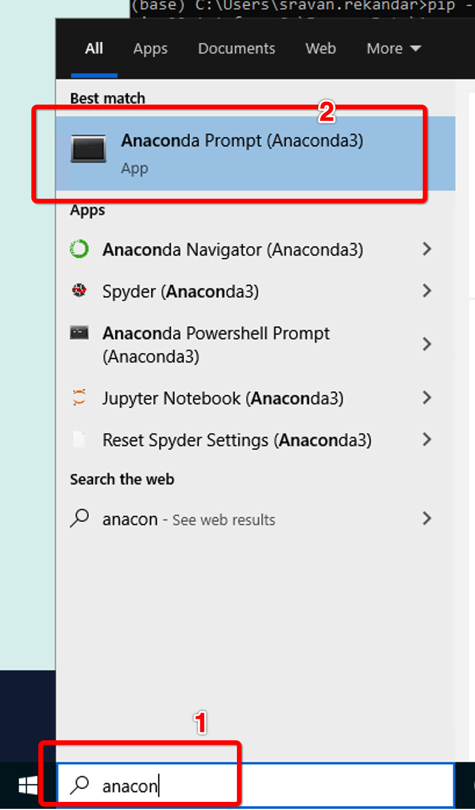
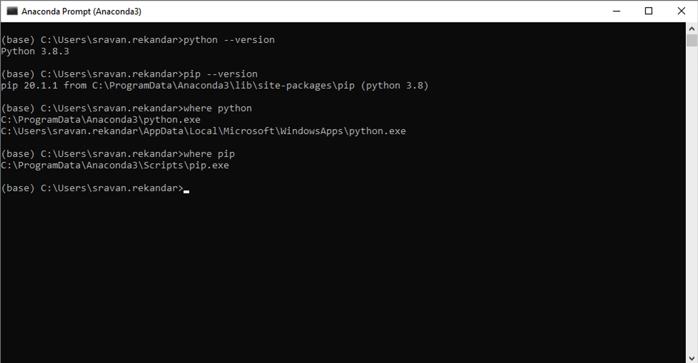
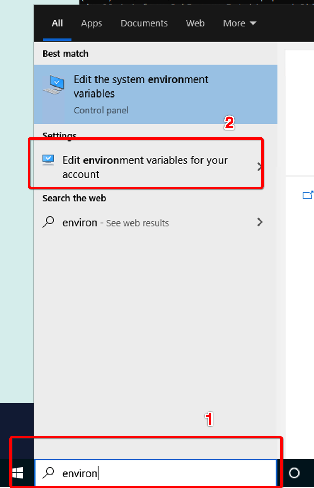
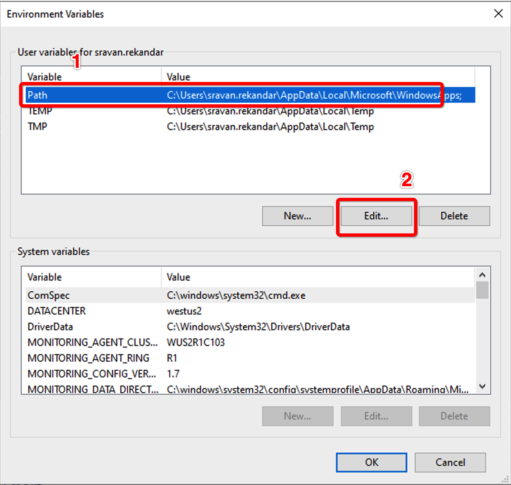
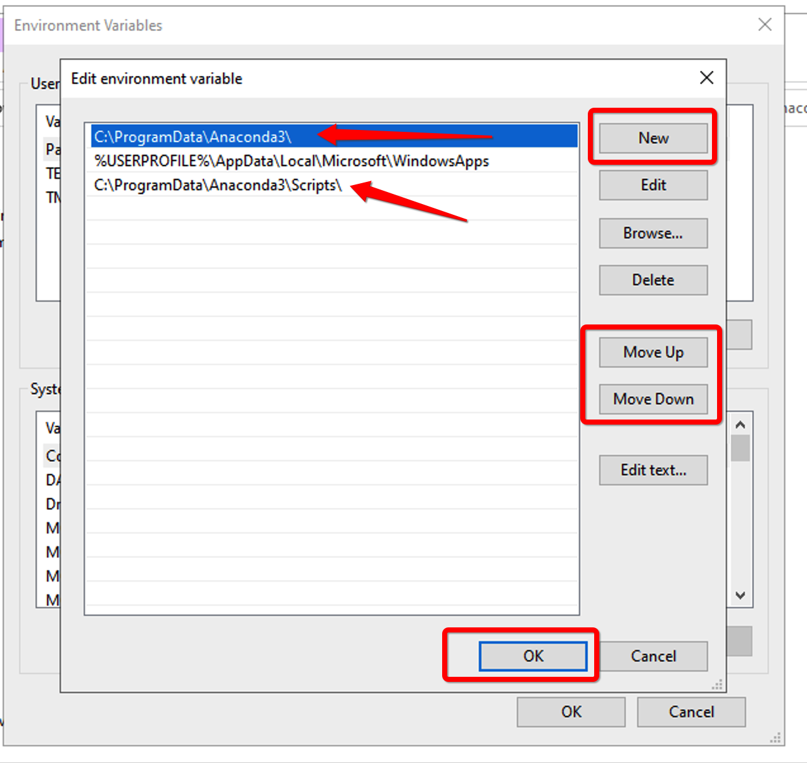

# Python InstallationOnWindows.md

## Use Anaconda to manage your python installations

- You can download Anaconda here: [https://www.anaconda.com/products/individual](https://www.anaconda.com/products/individual)
- Once you install Anaconda, Search in the Start menu for "Anaconda Prompt(Anaconda3)"
- If you find and open that, you can see a command prompt opens
- I am giving the outputs from my system. **sravan.rekandar** is my username. You must see your user name instead of mine.
- Check for python version using the bellow command

```cmd
(base) C:\Users\sravan.rekandar> python --version
Python 3.8.3
```

- Check for pip version using the bellow command

```cmd
(base) C:\Users\sravan.rekandar> pip --version
pip 20.1.1 from C:\ProgramData\Anaconda3\lib\site-packages\pip (python 3.8)
```

- To know the folders where python and pip are available, run the following commands

```cmd
(base) C:\Users\sravan.rekandar> where python
C:\ProgramData\Anaconda3\python.exe
C:\Users\sravan.rekandar\AppData\Local\Microsoft\WindowsApps\python.exe

(base) C:\Users\sravan.rekandar>where pip
C:\ProgramData\Anaconda3\Scripts\pip.exe
```

- As you see for python, there are two paths available. The first one is what we want. _The second one points to Windows App Store to install python. We will not use it for this tutorial_.

_Screenshots for your Reference_

**Search for Anaconda Prompt**



**Anaconda Prompt**



## Setting Environmental Variable - PATH for Python and Pip

### What are environment variables

Environment variables are named-variables that are available across the system. There might be many variables, the need of this hour is **PATH** environment variable.

_[Reference Article](https://en.wikipedia.org/wiki/Environment_variable)_

### What is PATH

PATH is a string, that represents a collection of folder paths. The folder paths are separated by ```;```_(semi column)_

**Example PATH**

```text
C:\Users\sravan.rekandar;C:\Users\sravan.rekandar\AppData;C:\Program Files\my_software_folder
```

#### The significance of PATH

Whenever you try to use a command(Eg: Python, pip, cls, mkdir,...) in a command line, the system goes through each folder to find the named command. If picks the first find command and executes it.

#### Add python and pip folder paths to PATH

If you open a general command prompt and try to access python and pip, you will not get anything. To access the both the modules, you will need to add the folder paths that contain these modules to an environmental variable **PATH**.

After you add these folder paths to **PATH**, each time you try to use python or pip in command prompt, the system will search for the same in the list of folder paths

- **Open Environmental Variables from start menu** Pick _Edit environment variables for your account_
- **Find the variable called Path** The case does not matter here. Hit on edit the variable. If there is no PATH variable, choose new and create one.
- **Add folder paths** Inside the _Edit environment variable Dialogue_ click on _New Button_ to add a new path. You have to add two paths
  - **Python folder path**: You have to give the string you got using the command ```where python```. In my case, it is ```C:\ProgramData\Anaconda3```. _IMPORTANT: This should be on top of rest of the paths. We want this to be picked up first_. You can use Move Up and Move Down buttons to change the order of the folder paths
  - **Pip folder path**: You have to give the string you got using the command ```where pip```. In my case, it is ```C:\ProgramData\Anaconda3\Scripts```
- After adding, Save and close the windows

_Giving the screenshot for your reference_

**Search for Environmental Variables**



**Path in Environmental Variables**


**Add Folder paths to the PATH**


## Check the availability of Python and Pip in a new command prompt

- Close any command prompts that are already open
- Open a new command prompt (Start -> Command Prompt)
- Check for the version of python and pip


